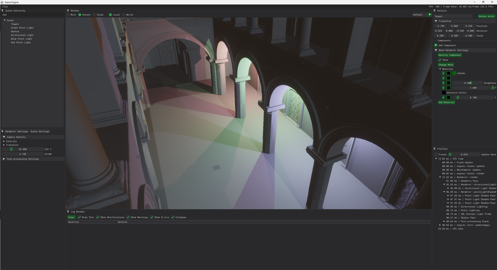
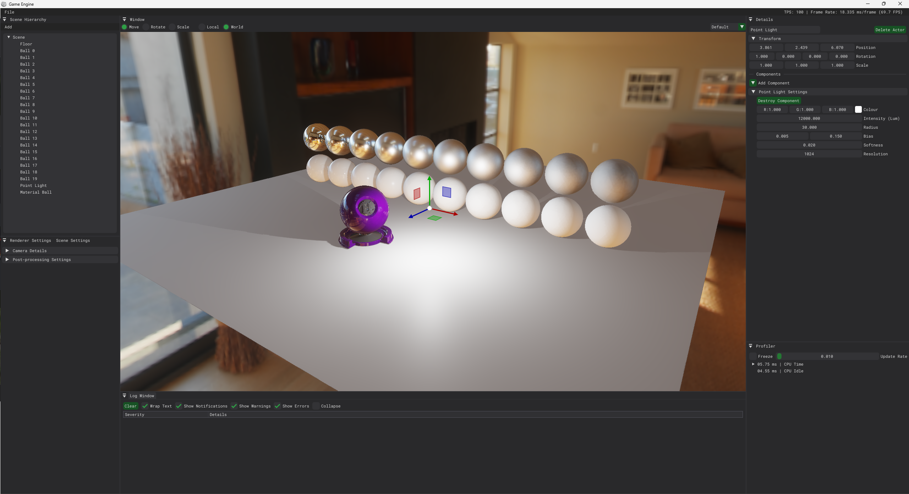
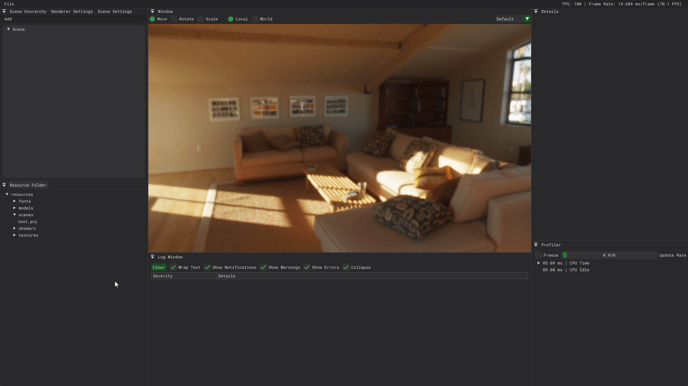

# Final Year Project (WIP)

___
The final year project is a mix between my dissertation, game engine programming and graphics and computational 
programming.

## Current Features

### Graphical Features
- Physically Based Shading
- Physically Based Lighting
- Directional Lights with CSM shadows
- Point Lights with shadows
- Distant Light Probe (IBL)
- HDR Bloom
- ACES Tone-mapping and EV Exposure
- Deferred Pipeline Debugging
- Shadow Map Debugging
- Material Editor
- Parallax Occlusion Mapping 
- Normal Mapping

### Engine Features
- Scene Loading
- Model Loading
- Scene Hierarchy
- Gizmo Tools
- Profiler
- Debug Logger

## Screenshot of the Editor

