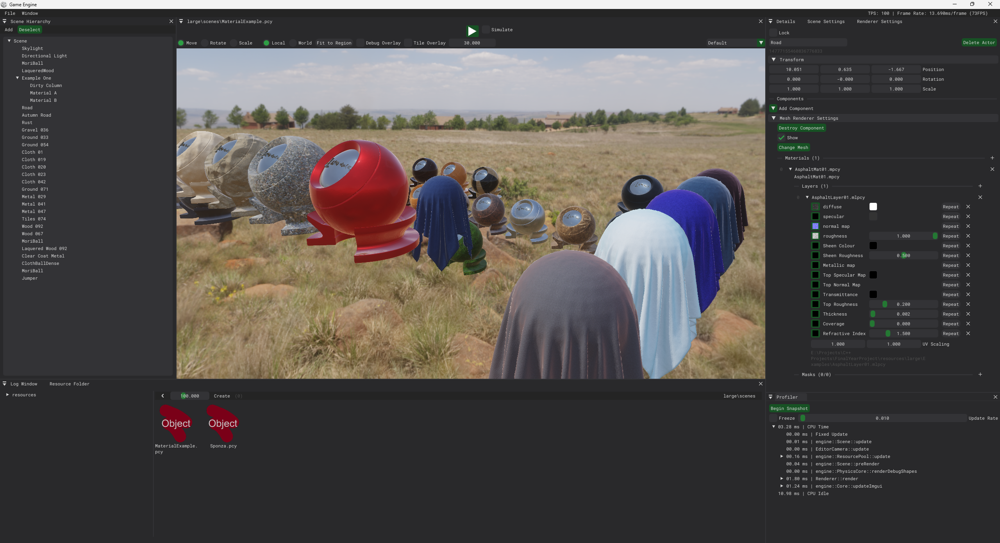
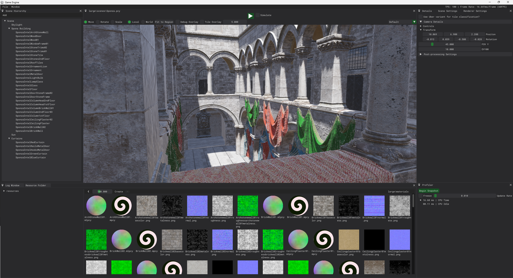
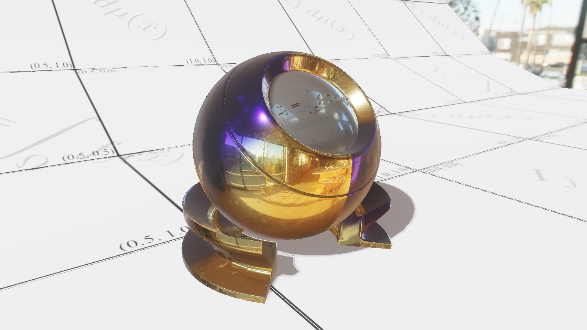
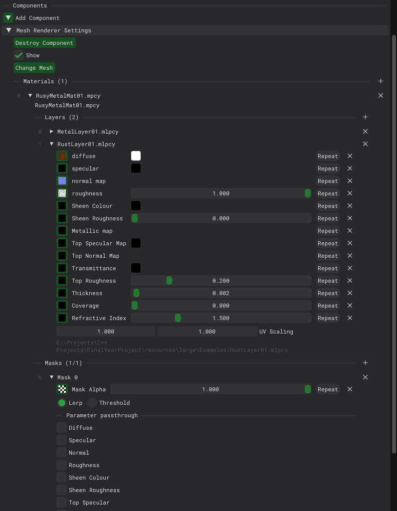
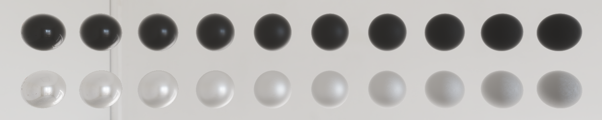
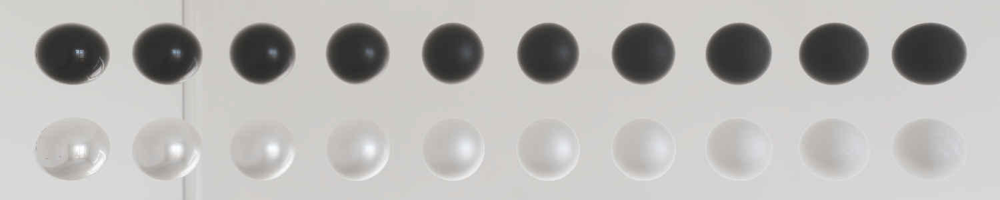
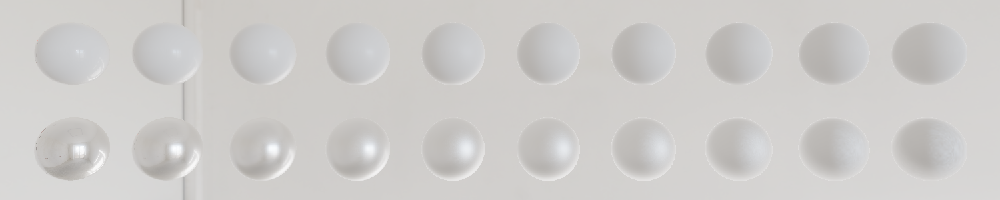
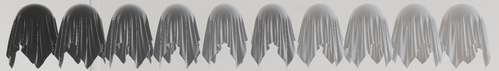
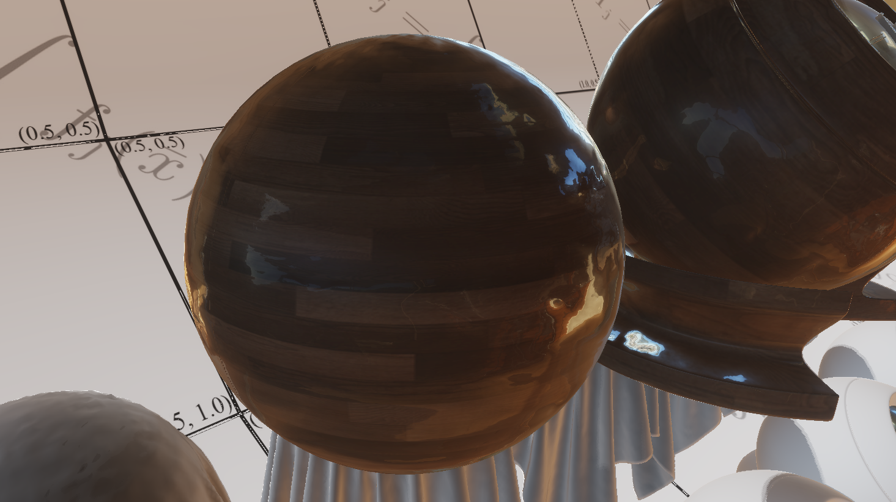

# A Physically Based Material System | Final Year Project

---

My project is a physically based material system for real-time rendering using OpenGL and C++. The main focus was on 
having multiple BRDF layers that are stacked on top of each other and react to lighting in a physically plausible way. 
The BRDFs used in this project are two specular lobes, a missing specular lobe, a diffuse lobe and a sheen lobe for 
effects such as dust and asperity scattering. My project also worked on improving the deferred renderer by using byte 
streams that significantly improve performance. Material classification (similar to tile-classification) was also 
implemented with the aim to improve performance but did not work because OpenGL is single threaded and does not allow 
for enough control over occupancy.

- Show-reel Video: https://www.youtube.com/watch?v=PEhXCa8yDyA
- Features Video: https://www.youtube.com/watch?v=mL5yBxnWxyI
- Dissertation: [github/Dissertation.pdf](github/Dissertation.pdf)

## Gallery

## BRDF Lobes
Multiple BRDF lobes are stacked on top of each other to give artists more control over a material.

### Specular

Isotropic Trowbridge-Reitz GGX with Smith Height-correlated masking-shadowing and fresnel-schlicks approximation. This 
is the industry standard and very well documented. 

### Missing Specular

Imageworks’s missing specular term. This is added because BRDFs only account for the first bounce of light which results 
in over darkening on rough materials.

### Diffuse

Keleman’s coupled diffuse term. This was to keep the scope of the project as small as possible. You would replace this 
term with more accurate subsurface scattering models for materials such as skin, vegetation or gummy bears. 

### Sheen

Disney’s LTC Sheen Layer that can be added on top of any other BRDF closure. 

### Second Specular & Transmittance

This is a second specular lobe with a thin substrate layer that can be controlled individually. This layer has not been 
tested for physical accuracy and was instead added to demonstrate the capabilities of the byte stream GBuffer.

## Deferred Rendering Pipeline
The renderer is a deferred renderer that stores information in a byte stream in a similar way that Unreal 5’s Substate 
works. In addition, lossy compression is used to compress data without noticeable artefacts. This means that we only 
need to read two RGBA32U textures when every feature is enabled and only one texture for a specular-diffuse setup.

## Material Classification System
Some materials do not need all features enabled. For instance, most materials do not need a Sheen Lobe applied for a 
dust-like effect. Therefore, a material classification shader can scan 16x16 tile areas to check which features are 
enabled. If said feature is not used, future shaders can skip complex computations.

On paper, this would sound great, but it did not work because I used OpenGL. OpenGL is single threaded which means that 
we can not fully saturate the GPU as one draw command must be fully finished before the next one starts. Additionally, 
modern GPUs are built for general purpose compute as so are really efficient at handling branches and diverging paths.

I will point out, however, that the tools for analysing OpenGL 4.6 code are very limited so my conclusions are based on 
researching how the GPU works.
